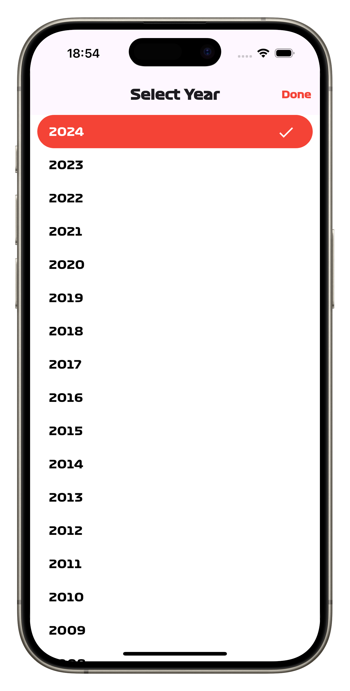
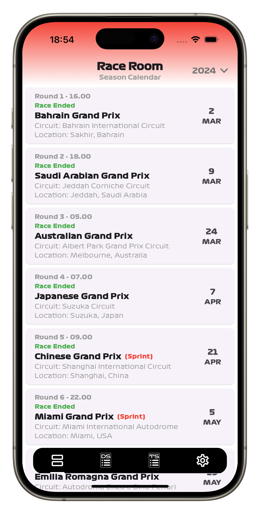
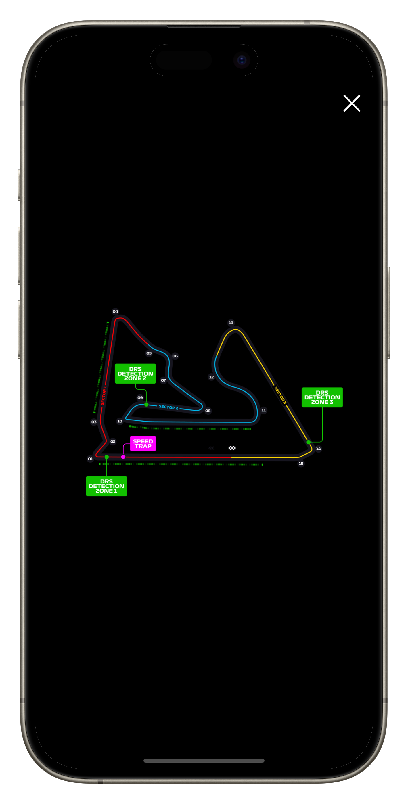
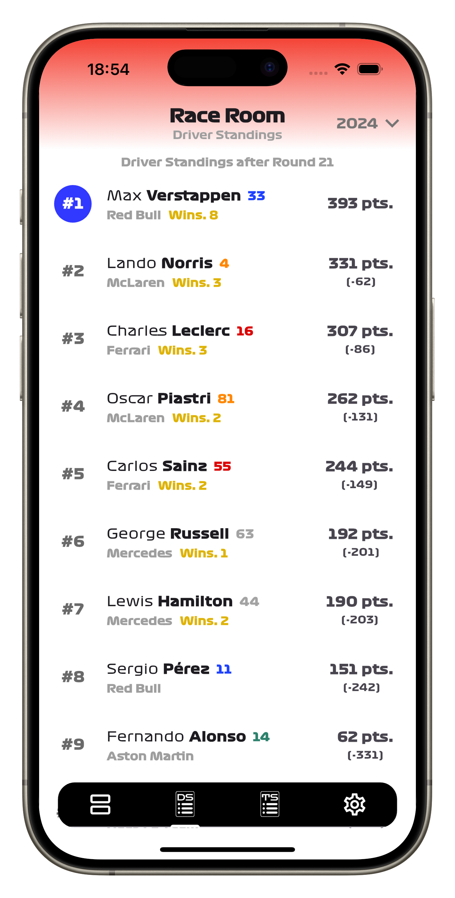
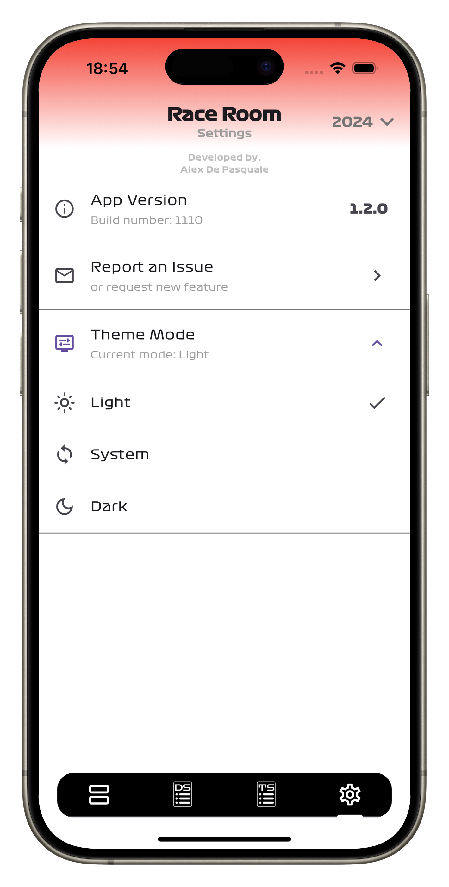

# Race Room

A Flutter project to have information on the F1 calendar, driver and team rankings and GP results at your fingertips.

The app uses [jolpica-f1](https://github.com/jolpica/jolpica-f1) APIs to get updated information (currently the APIs are updated every week 24 hours after the race).

## About the App

**The application has four main screens.**

- Season Calendar
- Driver Standings
- Team Standings
- Settings

**In each section at the top right you can open a screen to select the season (from 2006 to the current season).**

    

## Season Calendar

- In this section you can see the calendar for the selected season.

- With a tap on the event you can see the date, times of each session and the track map (it may not be available for all tracks from previous years).

- If the race has already been completed by clicking on the "VIEW RESULTS" button you can see the results of the race and the driver standings or team standings after that race (currently only available for the main race).

    
    
    
    

## Driver Standings

- In this section you can see the driver ranking for the selected season, the total points of the drivers with the difference from first place in the ranking and the number of victories.

    

## Team Standings

- In this section you can see the team ranking for the selected season, the total points of the teams with the difference from first place in the ranking and the number of victories.

    

## Settings

- In this section there are the application version, the possibility to report a bug and the possibility to change the application theme.

    
    

